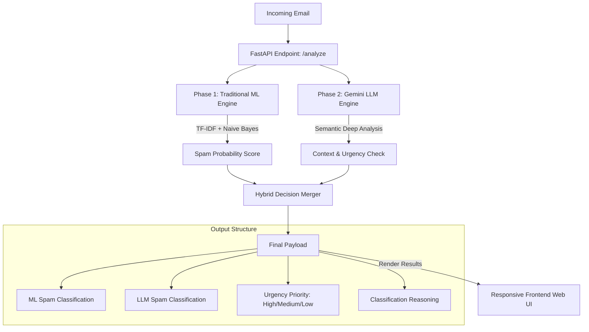

# 📩 IntelliMail AI: Hybrid Email Spam & Priority Classifier

IntelliMail AI is a state-of-the-art, dual-engine email analysis tool that combines traditional machine learning with advanced large language models (LLMs) to accurately classify emails, detect spam, prioritize workflows, and explain its classification reasoning in real-time.

Built with **FastAPI**, **scikit-learn**, and the **Google Gemini API** (`gemini-2.5-flash`), it serves both as a high-performance backend API and a slick, modern, responsive dark-themed web interface for users to audit and manage incoming emails.

---

## 🌟 Key Features

- **🧠 Hybrid AI Architecture**: Combines the high-performance speed of offline Machine Learning with the deep contextual intelligence of modern LLMs.
- **🛡️ Multi-Stage Analysis**:
  - **Phase 1 (Machine Learning)**: Uses a custom-trained **Multinomial Naive Bayes** pipeline with **TF-IDF vectorization** to predict spam probability offline.
  - **Phase 2 (LLM Contextualization)**: Leverages **Gemini 2.5 Flash** to perform deep semantic analysis, identify complex spam (phishing, social engineering), and assign priority.
- **⚡ Real-Time Priority Routing**: Automatically classifies emails into `HIGH`, `MEDIUM`, or `LOW` priority based on action urgency.
- **💬 Explainable AI (XAI)**: Generates human-readable, 1-2 sentence logical explanations for every classification decision.
- **🎨 Premium Dark UI**: Responsive, glassmorphic web dashboard with hover micro-animations, real-time feedback, and visual analysis breakdown.

---

## 🏗️ System Architecture

The following diagram illustrates how an incoming email is analyzed sequentially by both the traditional ML model and the generative LLM before rendering the final result:



---

## 📂 Project Structure

```text
IntelliMail AI/
│
├── data/                    # Model training data & serialized objects
│   ├── SMSSpamCollection    # Downloaded training dataset (UCI SMS Spam)
│   └── spam_classifier_model.pkl # Trained serialized Naive Bayes Model
│
├── frontend/                # Next.js web dashboard frontend (App Router)
│   ├── src/
│   │   └── app/
│   │       ├── globals.css  # Premium Neo-brutalist theme & custom variables
│   │       ├── layout.js    # Font optimization & SEO metadata
│   │       └── page.js      # Client component dashboard with history logic
│   ├── package.json         # Node.js project scripts & dependencies
│   └── next.config.mjs      # Next.js settings
│
├── static/                  # (Legacy) Static HTML/JS frontend files
│
├── .env.example             # Template for API keys
├── .gitignore               # Configured Git tracking rule exceptions
├── requirements.txt         # Project package requirements list
├── train_model.py           # Automated dataset setup and ML model training
├── llm_router.py            # Google GenAI SDK integration with Gemini 2.5 Flash
├── main.py                  # FastAPI server & route handlers
├── test_gemini.py           # Independent backend model pipeline testing script
└── list_models.py           # Diagnostic script to list available Gemini models
```

---

## 🚀 Quick Start Guide

### 1. Prerequisites
Make sure you have **Python 3.10 or higher** installed on your operating system.

### 2. Clone the Repository
```bash
git clone https://github.com/Nadeem0105/IntelliMail_AI.git
cd IntelliMail_AI
```

### 3. Create a Virtual Environment
Initialize a clean Python virtual environment to manage dependencies locally:
```powershell
# On Windows
python -m venv .venv
.venv\Scripts\activate

# On macOS/Linux
python3 -m venv .venv
source .venv/bin/activate
```

### 4. Install Dependencies
Install scikit-learn, FastAPI, Gemini API SDK, and helper tools:
```bash
pip install -r requirements.txt
```

### 5. Setup Environment Variables
Create a file named `.env` in the root folder (or duplicate `.env.example`) and add your Gemini API Key:
```env
GEMINI_API_KEY=your_actual_gemini_api_key_here
```
> 💡 *Note: To generate an API key, visit the [Google AI Studio](https://aistudio.google.com/).*

---

## 🏋️ Step 1: Train the Machine Learning Model

Before running the application, train the Naive Bayes spam classifier. The script will automatically download the standard **UCI SMS Spam Collection** dataset, clean it, split it into train/test sets, display accuracy metrics, and serialize the trained pipeline.

Run the training pipeline:
```bash
python train_model.py
```

*Expected Terminal Output:*
```text
Downloading dataset...
Extracting dataset...
Dataset ready in data/SMSSpamCollection
Loading data...
Training Naive Bayes Model with TF-IDF...
Model Accuracy: 97.49%
Classification Report:
              precision    recall  f1-score   support
         ham       0.97      1.00      0.99       966
        spam       1.00      0.82      0.90       149
saving model to data/spam_classifier_model.pkl...
Done!
```

---

## ⚡ Step 2: Start the Application

The application is split into a **FastAPI backend** (serving classification endpoints) and a **Next.js frontend** (serving the dashboard).

### A. Run the FastAPI Backend
Start the backend server on port `8000`:
```bash
uvicorn main:app --reload
```
- Interactive API Docs: [http://127.0.0.1:8000/docs](http://127.0.0.1:8000/docs)

### B. Run the Next.js Frontend
In a new terminal, navigate to the `frontend` folder, install Node packages, and start the development server on port `3000`:
```bash
cd frontend
npm install
npm run dev
```
- Local Web Interface: [http://localhost:3000](http://localhost:3000)

---

## 🔍 Detailed Component Mechanics

### 🔮 Machine Learning Engine (Offline Speed)
The offline classification engine uses a **TF-IDF (Term Frequency-Inverse Document Frequency) Vectorizer** to transform email strings into numerical feature matrices based on relative word importances. It processes these features through a **Multinomial Naive Bayes (MNB)** classifier:
- **Decision Confidence**: The model outputs the probability distribution of both `ham` and `spam`. If the model is **>60% confident** that the text is spam, it assigns a `SPAM` label; otherwise, it labels it `NOT_SPAM`.

### 🧬 Generative LLM Engine (Deep Intelligence)
To cover edge cases where traditional vocabulary matching fails (e.g., sophisticated phishing emails that mimic standard business text), the raw email is simultaneously routed to **Gemini 2.5 Flash**. 
- It uses structured JSON schema output to safely return:
  - Classification (`SPAM` / `NOT_SPAM`)
  - Workflow Priority (`HIGH` / `MEDIUM` / `LOW`)
  - A human-explainable reason detailing *why* the message was flagged.

---

## 🛠️ Diagnostics & Testing

To run individual tests on the backend Gemini integration to verify API health, you can run the built-in diagnostic files:

- **Check API key and list available Gemini models**:
  ```bash
  python list_models.py
  ```
- **Execute a mock email pipeline analysis test**:
  ```bash
  python test_gemini.py
  ```

---

## 📝 License
This project is licensed under the MIT License - see the LICENSE file for details.